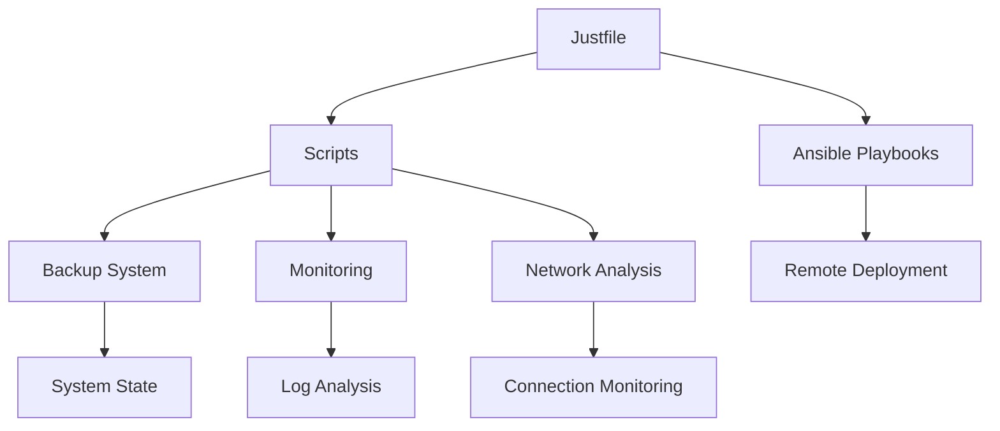

# Keyboard Kowboys - CCDC Operations Toolkit

> **A comprehensive cybersecurity operations toolkit for CCDC (Collegiate Cyber Defense Competition) environments**

## 📋 Table of Contents

- [[#Overview|Overview]]
- [[#Quick Start|Quick Start]]
- [[#Architecture|Architecture]]
- [[#Core Components|Core Components]]
- [[#Installation Guide|Installation Guide]]
- [[#Configuration|Configuration]]
- [[#Usage Guide|Usage Guide]]
- [[#Scripts Reference|Scripts Reference]]
- [[#Ansible Playbooks|Ansible Playbooks]]
- [[#Troubleshooting|Troubleshooting]]
- [[#Security Considerations|Security Considerations]]

## 🎯 Overview

The Keyboard Kowboys toolkit is a comprehensive cybersecurity operations platform designed specifically for CCDC environments. It provides automated system hardening, monitoring, backup, and incident response capabilities through a unified command interface.

### Key Features

- **🔒 Automated Hardening**: Baseline security configurations using Chimera
- **📊 System Monitoring**: Real-time monitoring and alerting
- **💾 Backup & Recovery**: Automated system state backups
- **🔍 Incident Response**: Quick system snapshots and analysis
- **🛡️ Persistence Detection**: Automated backdoor and rootkit scanning
- **🌐 Network Analysis**: Comprehensive network connection monitoring
- **📝 Log Analysis**: Automated log parsing and threat detection
- **🔧 Service Management**: Service integrity verification
- **🚀 Remote Deployment**: Ansible-based remote system management

## 🚀 Quick Start

### Prerequisites

- Linux system (Ubuntu 18.04+, CentOS 7+, or similar)
- Root or sudo privileges
- Internet connectivity for tool downloads
- Basic familiarity with command line operations

### Installation

1. **Clone the repository:**
   ```bash
   git clone https://github.com/CSUSB-CISO/csusb-ccdc.git
   cd csusb-ccdc/just-linux
   ```

2. **Run the setup script:**
   ```bash
   chmod +x scripts/setup-just.sh
   sudo ./scripts/setup-just.sh
   ```

3. **Initialize the environment:**
   ```bash
   just init
   ```

4. **Verify installation:**
   ```bash
   just status
   ```

### First Steps

1. **Create your first backup:**
   ```bash
   just backup
   ```

2. **Deploy monitoring:**
   ```bash
   just deploy-monitoring
   ```

3. **Check system status:**
   ```bash
   just status
   ```

## 🏗️ Architecture

The Keyboard Kowboys toolkit follows a modular architecture with clear separation of concerns:

```
/opt/keyboard_kowboys/
├── scripts/          # Core shell scripts
├── playbooks/        # Ansible automation
├── backups/          # System backups
├── tools/           # Installed security tools
├── configs/         # Configuration files
├── logs/            # Operation logs
└── ops/             # Operational scripts
```

### Component Relationships



## 🔧 Core Components

### 1. Justfile - Command Interface
The main command interface using the `just` command runner. Provides a unified way to execute all operations.

**Key Commands:**
- `just backup` - Create system backups
- `just diff` - Compare system states
- `just network-eval` - Analyze network connections
- `just status` - Show system status

### 2. Scripts Directory
Core shell scripts that implement the toolkit's functionality.

**Key Scripts:**
- `backup.sh` - System backup and recovery
- `network_eval.sh` - Network analysis
- `log_analyzer.sh` - Log analysis and threat detection
- `verify_services.sh` - Service integrity checking

### 3. Ansible Playbooks
Automated deployment and configuration management.

**Playbooks:**
- `just_install.yml` - Initial system setup
- `just_remote.yml` - Remote command execution

## 📦 Installation Guide

### Detailed Installation Steps

1. **System Requirements Check:**
   ```bash
   # Check system architecture
   uname -m
   
   # Check available tools
   which wget curl tar unzip
   ```

2. **Download and Setup:**
   ```bash
   # Download the toolkit
   wget https://github.com/CSUSB-CISO/csusb-ccdc/releases/download/CCDC-2024-2025/just-lin.zip
   unzip just-lin.zip
   cd just-linux
   
   # Make scripts executable
   chmod +x scripts/*.sh
   ```

3. **Run Setup Script:**
   ```bash
   sudo ./scripts/setup-just.sh
   ```

4. **Verify Installation:**
   ```bash
   just --version
   just status
   ```

### Post-Installation Configuration

1. **Configure Ansible:**
   ```bash
   # Edit hosts.ini with your target systems
   nano /opt/keyboard_kowboys/hosts.ini
   ```

2. **Set up monitoring:**
   ```bash
   just deploy-monitoring
   ```

3. **Create initial backup:**
   ```bash
   just backup
   ```

## ⚙️ Configuration

### Ansible Configuration

The toolkit uses Ansible for remote management. Configure your target systems in `hosts.ini`:

```ini
[linux]
server1 ansible_host=192.168.1.10
server2 ansible_host=192.168.1.11

[linux:vars]
ansible_user=root
ansible_connection=ssh
ansible_shell_type=sh

[windows]
win1 ansible_host=192.168.1.20

[windows:vars]
ansible_user=Administrator
ansible_connection=ssh
ansible_shell_type=powershell
```

### Password Configuration

For secure remote access, configure passwords using Ansible Vault:

1. **Create encrypted password file:**
   ```bash
   ansible-vault create group_vars/linux.yml
   ```

2. **Add password variables:**
   ```yaml
   ansible_ssh_pass: "your_secure_password"
   ```

3. **Use in playbooks:**
   ```bash
   ansible-playbook -i hosts.ini playbooks/just_install.yml --ask-vault-pass
   ```

### Backup Configuration

Configure backup settings in `/opt/keyboard_kowboys/configs/backup.conf`:

```bash
# Backup retention (days)
RETENTION_DAYS=30

# Compression level (1-9)
COMPRESSION_LEVEL=9

# Exclude patterns
EXCLUDE_PATTERNS="*.tmp *.log /tmp/*"

# Remote backup location
REMOTE_BACKUP_URL=""
```

## 📖 Usage Guide

### Basic Operations

#### System Backup
```bash
# Backup all systems
just backup

# Backup specific system type
just backup network
just backup firewall
just backup services
```

#### System Comparison
```bash
# Compare current state with latest backup
just diff

# Compare specific components
just diff ports
just diff processes
just diff services
```

#### Network Analysis
```bash
# Basic network check
just network-eval

# Detailed network analysis
just network-eval detailed
```

#### Service Management
```bash
# Verify service integrity
just verify-services

# Check only critical services
just verify-services true
```

### Advanced Operations

#### Incident Response
```bash
# Create incident snapshot
just incident-snapshot suspicious_activity

# Analyze recent logs
just analyze-logs 24
```

#### Security Tools
```bash
# Install security tools
just install-tools

# Check for persistence mechanisms (backdoors, rootkits)
just check-persistence

# Check specific categories
just check-persistence --cron --ssh
just check-persistence --profiles --suid

# Scan for PII
just find-pii

# Reset firewall
just reset-firewall
```

#### Remote Operations
```bash
# Deploy to all systems
just remote install all

# Run command on specific host
just remote "backup" server1
```

## 📚 Scripts Reference

### Core Scripts

#### backup.sh
**Purpose:** Creates comprehensive system backups
**Usage:** `./backup.sh [system_type] [backup_directory]`
**Options:**
- `system_type`: all, network, firewall, services, database, web, custom
- `-v`: Verbose output
- `-d`: Dry run mode

#### network_eval.sh
**Purpose:** Analyzes network connections and services
**Usage:** `./network_eval.sh`
**Features:**
- Port scanning
- Service identification
- Connection analysis
- Threat detection

#### log_analyzer.sh
**Purpose:** Analyzes system logs for security events
**Usage:** `./log_analyzer.sh [hours]`
**Features:**
- Authentication failure detection
- Sudo command monitoring
- System error analysis
- Service status checking

#### verify_services.sh
**Purpose:** Verifies service integrity and configuration
**Usage:** `./verify_services.sh [critical_only]`
**Features:**
- Service status checking
- Binary integrity verification
- Configuration validation
- Permission checking

#### check_persistence.sh
**Purpose:** Detects persistence mechanisms and backdoors
**Usage:** `./check_persistence.sh [OPTIONS]`
**Options:**
- `-v, --verbose`: Enable verbose output
- `-a, --all`: Run all checks (default)
- `-c, --cron`: Check cron jobs only
- `-s, --systemd`: Check systemd services only
- `-i, --init`: Check init scripts only
- `-p, --profiles`: Check shell profiles only
- `-l, --ld-preload`: Check LD_PRELOAD only
- `-k, --kernel`: Check kernel modules only
- `--ssh`: Check SSH keys only
- `--suid`: Check SUID/SGID files only

**Detection Categories:**
- **Cron Jobs**: Suspicious commands in crontabs
- **Systemd Services**: New/modified services and timers
- **Init Scripts**: Changes to rc.local and init.d
- **Shell Profiles**: Backdoors in .bashrc, .profile, etc.
- **LD_PRELOAD**: Library injection attempts
- **Kernel Modules**: New loaded modules
- **SSH Keys**: Modified authorized_keys
- **SUID/SGID**: New privileged binaries

**Features:**
- POSIX-compliant (works on BusyBox)
- Baseline comparison against backups
- Severity levels (CRITICAL, HIGH, MEDIUM)
- Timestamped reports saved to logs
- Exit code 1 if issues found (scriptable)

### Utility Scripts

#### setup-just.sh
**Purpose:** Initial system setup and tool installation
**Usage:** `./setup-just.sh`
**Features:**
- Directory structure creation
- Tool downloads
- Permission setting
- Environment configuration

#### install_tools.sh
**Purpose:** Installs security tools using Nix
**Usage:** `./install_tools.sh`
**Features:**
- Nix package manager setup
- Security tool installation
- Environment configuration

#### docker-static.sh
**Purpose:** Installs Docker static binaries
**Usage:** `./docker-static.sh [version]`
**Features:**
- Architecture detection
- Binary download
- Service configuration
- User group management

## 🎭 Ansible Playbooks

### just_install.yml
**Purpose:** Deploys the toolkit to remote systems
**Usage:** `ansible-playbook -i hosts.ini playbooks/just_install.yml --ask-vault-pass`

**Features:**
- Linux and Windows support
- Automated script deployment
- Service configuration
- User management

### just_remote.yml
**Purpose:** Executes commands on remote systems
**Usage:** `ansible-playbook -i hosts.ini playbooks/just_remote.yml -e "remote_command='just backup'" --ask-vault-pass`

**Features:**
- Remote command execution
- Cross-platform support
- Result collection
- Error handling

## 🔧 Troubleshooting

### Common Issues

#### Permission Denied Errors
```bash
# Ensure scripts are executable
chmod +x scripts/*.sh

# Run with appropriate privileges
sudo just backup
```

#### Network Connection Issues
```bash
# Check network connectivity
just network-eval

# Verify firewall settings
just reset-firewall
```

#### Backup Failures
```bash
# Check disk space
df -h

# Verify backup directory permissions
ls -la /opt/keyboard_kowboys/backups/
```

#### Ansible Connection Issues
```bash
# Test connectivity
ansible all -i hosts.ini -m ping

# Check SSH configuration
ssh -v user@host
```

### Debug Mode

Enable verbose output for troubleshooting:

```bash
# Backup with verbose output
just backup -v

# Network analysis with debug info
just network-eval detailed

# Ansible with verbose output
ansible-playbook -i hosts.ini playbooks/just_install.yml -vvv
```

### Log Files

Check log files for detailed error information:

```bash
# Main operation log
tail -f /opt/keyboard_kowboys/logs/operations.log

# Backup log
tail -f /opt/keyboard_kowboys/logs/backup.log

# System log
journalctl -f
```

## 🔒 Security Considerations

### Password Management

**Important:** The toolkit uses default passwords for demonstration purposes. In production environments:

1. **Use Ansible Vault:**
   ```bash
   ansible-vault create group_vars/linux.yml
   ansible-vault create group_vars/windows.yml
   ```

2. **Set strong passwords:**
   ```yaml
   ansible_ssh_pass: "your_strong_password_here"
   ```

3. **Rotate passwords regularly:**
   ```bash
   ansible-vault rekey group_vars/linux.yml
   ```

### SSL Certificate Verification

The toolkit disables SSL certificate verification for downloads. In production:

1. **Verify download sources**
2. **Use internal mirrors when possible**
3. **Implement certificate pinning**

### File Permissions

Ensure proper file permissions:

```bash
# Set secure permissions
chmod -R 750 /opt/keyboard_kowboys/
chmod 600 /opt/keyboard_kowboys/group_vars/*.yml
```

### Network Security

1. **Use VPN for remote operations**
2. **Implement firewall rules**
3. **Monitor network traffic**
4. **Use encrypted connections**

## 📞 Support

For support and questions:

- **Documentation:** Check this README and individual script documentation
- **Issues:** Report issues on the GitHub repository
- **Community:** Join the CCDC community discussions

## 📄 License

This project is licensed under the MIT License - see the LICENSE file for details.

## 🤝 Contributing

Contributions are welcome! Please:

1. Fork the repository
2. Create a feature branch
3. Make your changes
4. Add tests if applicable
5. Submit a pull request

## 📈 Roadmap

- [ ] Automated threat detection
- [ ] Integration with SIEM systems
- [ ] Cloud deployment support
- [ ] Advanced reporting features

---

**Keyboard Kowboys** - Defending the digital frontier, one command at a time! 🛡️